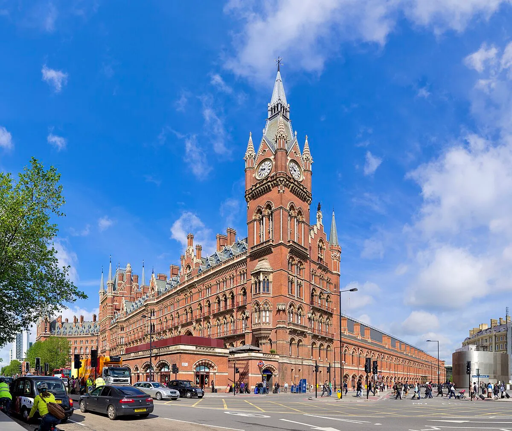
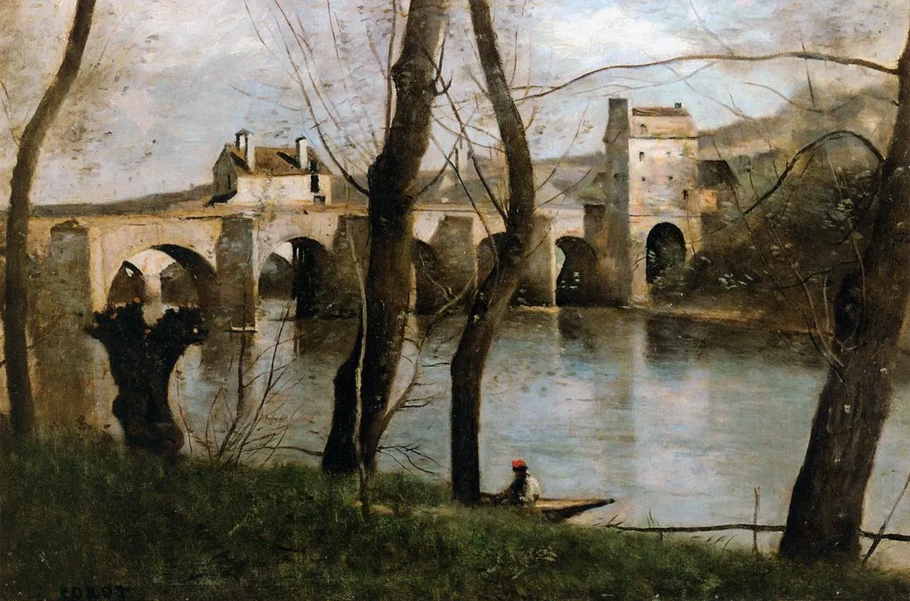

konec 18. stol. ve výtvarném umění od 20. let 19. stol.

- umělecké  a myšlenkové hnutí, národy hledají svoji identitu, historii, lidová kultura
- opozice klasicismu
- do opozice staví cit, vášeň, subjektivitu, tvarová bohatost, bizardnost, uvolnění, osobnost
- inspirace historismem, středověkými slohy, orientálním a lidovým uměním
- rozpory mezi ideály a skutečností - věční rozervanci - K. H. Mácha, Jean Jacques Rousseau
- hlavně - literatura, výtvarné umění - malířství, zahradní umění
- kolébkou je Anglie
- podstatnou je romantická estetičnost
- rozervanost - rozpor jedince - mezi ideály a skutečností
- romantická krajina = hluboké rokliny, zříceniny, měsíc v úplňku, útesy, rozběsněné moře, vodopády, skály, hluboké lesy
- zdroj inspirace - historismus - napodobení středověkých slohů hlavně gotiky později tzv. novogotika = pseudogotika, novorenesance, neobaroko, druhé rokoko - do nástupu secese
- určitá stagnace v umění, absence tvůrčí invence
- Purismus = restaurování středověkých památek, ideální slohový prototyp, tím byla sestřena osobitost památek, nadělalo se více škody než užitku
- Hudba - romantismus - Franz Schubert, Robert Schumann, Carl Maria von Weber, František Škroup
- Hudba - novoromantismus - Rochard Wagner, Hector Berlioz, Bedřich Smetana, Antonín Dvořák, Pjotr Iljič Čajkovskij
- eklektismus - míšení stylů naa jedné stavbě

# Architektura

- tupé zakončení věží a nárožních věžiček, věže mnohaboké
- zubaté cimbuří - vliv anglické gotiky
- válcovité, hrotitě zastřešené věže, strmé střechy - vliv Francie
- klasicismus a romantismus přináší nové materiály v architektuře - kovovou konstrukci = obrovský zastřešený prostor - **Křišťálový palác** pro první světovou výstavou v Londýně, mosty v lokti, **Brooklinský most NYC**

Křišťálový palác - Londýn

Brooklinský most - NYC

- stavby:
- **Westminsterský chrám a opatství - Londýn**

- **katedrála v Edinburgu**
    
    
    
- **londýnský parlament**
- **parlament v Budapešti**
    
    
    
- **staroanglická venkovská sídla**
- druhá polovina 19. stol. - historizující slohy
- **Grand Central NYC**
    
    
    

### Eugéne-Emmanuel Viollet-le-Duc -  Vollet-le-Duc - restaurace Notre Dame

### Park

- přírodní, krajinářský - využívá se přirozených vlastností zeleně, doplněno drobnou architekturou, skleníky, altány, umělé jeskyně - grotta
- park v Lednici - minaret, zřícenina Janova hradu
- vznik městských parků - **Central park NYC, Bolognský park - Paříž**
    
    
    
    central park - nyc
    
- nové architektonické materiály - železné konstrukce, zavěšené řetězové mosty - Loket - později lana
- **Lednický park - zámek, minaret, Janův hrad**
    
    
    
    Lednický park - Janův hrad
    
    
    
    Lednický park
    

### novorenesance

- nádražní haly - **Grand Central NY, St. Pancras v Londýně** - viktoriánská gotika

St. Pancras - Londýn

### Gustav Eiffel

- geniální architekt železných konstrukcí
- **konstrukce Sochy svobody NYC**
- projektant **zdymadel Panamského průplavu**
- **Eiffelova věž - Paříž** - 305m vysoká - ve své době nejvyšší stavbou světa

### Frédéric Auguste Bartholdi

- postavil **Sochu svobody 1886** - věnovaná Francií USA - stoleté výročí americké nezávislosti

### Francois Rude

- **Marseillaissa** - triumfální oblouk nám Etoile

## Čechy

- historismus
- neogotika
    - **zámek Hluboká - přestavba Františka Beer a Franz Damasus Deworetzky**
    
   
    
    - **Sychrov**
    
    
    
    - **Lednice**
    - **Orlík**
    - **Hrádek u Nechanic**
    - **bazilika sv. Petra a Pavla na Vyšehradě**
    
    
    
    - **sv. Ludmila na Vinohradech**
    
    
    
    - **úprava sv. Barbory v Kutné Hoře**
    - **Třeboň**
    
    
    
    - **sv. Prokop Žižkov**
    
    
    
- neorománský sloh - **Bazilika sv. Cyrila a Metoděje - Karlín**

- neorenesance - **kostel sv. Václava na Smíchově**
    
    
    
- 1844 - J**ednota pro dostavbu chrámu sv. Víta** - necitlivé zásahy - **J. O. Kranner, J. Mocker**, naštěstí dokončil **Kamil Hilbert**
- purismus zasáhl i **Karlštějn, chrám sv. Václava v Olomouci, kostel ve Vysokém mítě**
    
    
    
    chrám sv. Václava - Olomouc
    
- dobře zrestaurovaný - **hrad Kokořín**
    
    
    
- Ignác Ulmann - Vyšší dívčí škola Vodičkova ul.

# Sochařství

- vzorem už není antika
- více realistické, dramatické - nemá ale samostatný styl
- náměty - historie, součastnost

### Francois Rude

- portréty
- dramatické reliéfy
- **Marseillaisa na vítězném oblouku na nám. Etoille**
    
    
    
- **socha Jany z Arku**
    
    
    
- **pomník maršála Neye**
    
    
    
- **Napoleon**

### Frédéric Auguste Bartholdi

## Čechy

- nevýrazné období v č. sochařství

### Josef a Emanuel Maxovi

- řemeslně zručný, strohá modelace
- **Pomník maršála Radeckého**
    
    
    
- **Krannerova kašna - Císař František I. na Smetanově nábřeží**
    
    
    
- **sochy pro Karlův most**

### Václav Levý

- náš jediný romantický sochař, zakladatelská osobnost českého národního sochařství
- učitel Josefa Myslbeka
- pracoval na panství vlastence Antonína Veitha
- inspirován Braunovým Betlémem

- nedaleko Libechova do skal - **Čertovy hlavy - Želízy**
    
    
    

- u Veithova zámku v lese - **fantaskní hlavy, Harfenice, reliéf Hada, Ještěra**
- soubor skalních skulptur - **Blatník - nadživotní postavy Jana Žižky, Prokopa Holého, Zdenka Zásmuckého**
- poslán na školu do Mnichova, zde se spřátelil s Josefem Mánsem
- zde vytvořil hrdinu rukopisů - **Lumíra, sousoší Adama a Evy** - představa o kráse české ženy

Lumíra

- nepříznivé podmínky v Čechách → odchod do Říma
- **Kristus, Marie a Marta**

Kristus u Marie a Marty

# Malířství

- nejdůležitější obsah a forma
- rozporuplnost individua
- až. krutá pravdivost
- náměty ze středověkých dějin nebo ze soudobých událostí, inspirace divadlem, literaturou, lidovým uměním
- dramatičnost, děj vyhrocen do maxima
- barvy dotvářejí atmosféru obrazu, opět zájem o barvu
- Krajinomalby - neklidné, nevšední, tajuplné, dramaticky zjitřené, sblížené s přírodou, postupně spěje k věcnosti - realismu

### Théodore Géricault

- barokně dramatický, koně, napoleonské scény, napětí
- **Vor (Prám) Medúzy** - ztroskotání fregaty Méduse, po 12denní plavbě na voru se zachránilo bez jídla a pití jen 10 lidí, dramatická scéna

### Eugéne Delacroix

- pocházel z intelektuálního prostředí
- teoretik, kritik
- spojil tradici vlámskou a benátskou, předchůdce impresionistů - rozklad barvy do plošných skvrn
- navázal na Géricaulta, působil na něj Rubens, Goya, měl nejkrásnější paletu Francie
- scény plné vzrušení, dramatičnosti, fantazie
- **Krveprolití na Chiu**

- **Svoboda vedoucí lid na barikády**

- **Jezdec napadený jaguárem** - NG

- **Alžírské ženy ve svém pokoji**

- **George Sandová**

- **Fryderyk Chopin**

- **Vyhnání Heliodora z chrámu** - z kostela Saint-Sulpice - Paříž
- **Zápas Jakuba s andělem** - z kostela Saint-Sulpice - Paříž

## Barbizonská škola

- romantikové ve Francii
- 1830 - usadili se ve vesnici Barbizon na kraji Fontainbleuského lesa
- inspirováni holandskou a anglickou krajinou
- **Theódor Rousseau, Diaz de la Peňa, Jules Depré, Charles Daubingny aj.**
- částečně **Jean-Baptiste Camille Corot, Jean Francoise Millet aj.**
- Malovali nejprve v plenéru skici, pak v ateliéru podle nich finální obrazy
- předchůdci impresionistů

### Jean Francois Millet

- v Barbizonu téměř celý život
- lidé v krajině - sedláci, ženy na poli
- realistické, až naturalistické - každodenní život, práce
- **Sběračky klasů**

- **Anděl Páně - Polední modlitba**

- **Rozsévač**

- **Stohy sena**

### Jean-Baptiste Camille Corot

- jeden z největších krajinářů světa - intimní krajinomalba
- studia klasické krajiny - cesty do itálie, Normandie, Fontaineblau
- Mlžný stříbrný opar, v něm se tvary rozplívají
- **Most v Mantes**
    
    
    
- **Forum Romanum**
- **Pohled na Florencii z Giardino di Boboli**
    
    
    
- **Katedrála v Chartres**
- **Vzpomínka na Coubron**
- **Žena s perlou**
    
    
    

### John Constable

- angličan
- skici i obrazy s jedním námětem - mraky s atmosférou
- **Wivenhoe Park**

### William Turner

- angličan
- osvobodil se od realistického tvaru
- subjektivní romantické pojetí
- **Déšť, pára, rychlost** - až lyricky abstraktní, pohyb vlaku, opar -NG-londýn
    
    
    
- **Bouře**

### Caspar David Friedrich

- němec
- krajiny s tragickým nádechem s figurami - pocity osamění v konfrontaci velikosti přírody, postavy jsou zády, dívají se na moře, hory, východ měsíce
- námět lodi - symbol plavby životem
- maloval oblasti Pomořan, Harzu, ale i Krkonoše a České středohoří
- **Kříž v horách**

- **Dva muži pozorující měsíc**
- **Křídové útesy na Rujaně**
- **Milešovka**
- **Poutník nad mořem mlhy**
    
    
    

# Romantismus v Čechách a na Moravě

# Architektura

- **Dostavba chrámu sv. Víta** - novogotické úpravy - **J. O. Kranner, Josef Mocker, Kamil Hilbert**
- **dostavba Karlštejna**
- **Bazilika sv. Petra a Pavla - Vyšehrad, svatá Ludmila - Vinohrady, sv. Prokop - Žižkov**
- **Novogotické úpravy Hluboké, Lednice, Orlíka, Sychrova, Kokořín**
- nově vybudovný zámek - **Hrádek u Nechanic, Shwarzenberská hrobka v Třeboni**

### Pseudohistorické slohy

- hlavně novorenesance - radnice, veřejné, reprezentativní budovy, generace ND
- novogotika a novorománský sloh - především u sakrální architektury a zámků
- **tržnice nádražní haly**
- **Generace ND** (1868-1881)- architekt **Josef Zítek**, Rudolfinum dokončil **Josef Schultz**, také autorem Národního muzea a Uměleckoprůmyslového muzea

# Malířství

### Antonín Mánes

- rozervané scenérie, rozeklaná skaliska, zbytky středověkých staveb
- **Krajina se zříceninou**

- **Hrad Křivoklát**

- **Bouře u Cibulky**
    
    
    
- **Skála mezi Braníkem a Podolím**
    
    
    

### Josef Navrátil

- evropská úroveň
- dokonale ovládal barvu
- vynikající zátiší
- vyučil se u otce malíře pokojů
- nástěnné malby:
    - **o Vlastě a dívčí válce**
    - **Alpské pokoje - zámek Jirny**
    - **fresky - Vávrův dům v Praze**
- olejomalby krajin:
    - **Hon na lišku**
    
    
    
    - **Vodopád pod Dachsteinem**
    
    
    
    - **Osamělá kaplička**
    
    
    
    - **Plachetnice na jezeře pod ledovcem**
    
    
    
- zátiší:
    - **Vařený humr**
    
    
    
    - **Slívy**
    
    
    
    - **Sledě**
    - **Hrušky na míse**
    - **Paštika**
    - **Rozkrojený meloun**
    
    
    
    - **Zátiší s pomeranči**
    
    
    
    - **Švestky se snítkou**
    
    
    
- uvolněná až moderní malba - uvolněný rukopis
- inspirace divadlem:
    - **Podobizna herečky**
    - **Překvapená**
    - **Othello a Desdemona**
    - **Sen noci svatojánské**

### Josef Mánes

- bohatá výtvarná kultura českého a slovenského lidu
- zakladatel českého národního umění
- zkušenosti od otce (Antonín Mánes)
- obdiv k italské renesanci hlavně k Raffaelovi
- na Akademii ho ovlivnil František Tkadlík
- **Hrobník**
- **Smrt Lukáše Leydenského**
- **Setkání Petrarky s Laurou**
- v Mnichově → zájem o historii starých Slovanů → cesty do Polska a Slezska → studie krojů
- 1849 - 1850 → pobyt v zámku Čechy pod Košířem → národopisné cesty za kroji a lidovými typy Hané → cyklus **Zábavy na panském sídle**
- **Líbánky na Hané** - grafické listy - národopisné studijní cesty
- **Cyklus Musica** - cesta člověka od kolébky k hrobu → po pobytu na Hané
- studie dívek:
    - **Veruna Čudová**
    - **Johana Dvořáková**
    - **Marina Kurincová**
- studie mládenců:
    - **Jan Postava**
    - **Liptovský Gazda**
- ilustrace - **Rukopis královédvorský**

- portréty:
    - **Paní Belská**
    - **Hraběnka Stolbergová**
    - **Paní Václavíková**
    - **Josefina**
    
    
    
- obrazy ve studiu druhého rokoka:
    - **Políbení**
    - **Prři měsíčku**
    - **Život na panském sídle**
- žánrové obrazy:
    - **Švadlena**
    
    
    
    - **V létě**
    - **Jitro**
    - **Večer**
- plenérové obrazy:
    - **Labská krajina**
    - **Řípský kraj**
- **deska pražského orloje - 1866 - 12 měsíců**
- **Milenci**

- **Kající se Máří Magdaléna**
- **Blíženci**

- **prapor Sokola**

### Adolf Kosárek

- výlučný krajinář
- romantické atmosféry - **Jezera v bouři**
- prosté motivy, geologie krajiny, přirozené osvětlení
- krajiny středních Čech, Českomoravská vysočina
- přibližují se k nizozemskému realismu
- **Selská svatba**

- **Česká krajina**
- **Krajina ze středních Čech**
- **Studie skla ze Šárky a Hlubočep**
- **Noční vítr**
- **Zimní noc**

- **Horská krajina s vodopádem**

- **Krajina v bouři**

- **Hřbitov u moře**

- **Před bouří**

### August Bedřich Piepenhagen

- němec
- samouk
- krajinář - až naturalistický
- žil a tvořil v Praze
- žádaný krajinář, prodával obrazy

> *“Umění jde za chlebem, ale řemeslo ho nalézá”*
> 
- krajiny před bouří, osamělý poutníci, zříceniny, vodopády, zasazeno často do soumraku, podvečeru
- **Vyhlídka**
- **Měsíční noc s pocestnými**

- **Zimní krajina se zříceninou a kapličkou**

- **Krajina s mostem**

- **Moře od Helgolandu**

### Bedřich Havránek

- malíř ilustrátor
- veduty hradů a měst, přírodní zákoutí
- skicy v plenéru
- olej, akvarel - kombinace tempery a akvarele
- **U Rájce na Moravě**

- **Z okolí Svitavy na Moravě**

- **Skaliska**

- **Les v Cholticích**

### Julius Mařák

- krajinář, grafik, pedagog
- snivost, romantičnost, magické lesní průhledy
- na zakázku výzdoba ND - **Říp, Blaník, Vyšehrad**

Říp

Vyšehrad 

Blaník

- krajinomalby na schodišti NM - **Karlštejn, Pražský hrad, Křivoklát a Zvíkov**
- **Ranní píseň**
- **Les**
- **Lesní zátiší**
- Kresby uhlem:
    - **Čtyři roční období**
    - **Čtyři denní doby**
- dcera Josefina také malířka, pomáhala mu s obrazy
- **Lesní zátiší**

- **Skalní soutěska**

- **Krajina s bažinou**

- **Starý dub**

- **Šumavský prales**

- **Pramen**

- **Návrat z pastvy**

